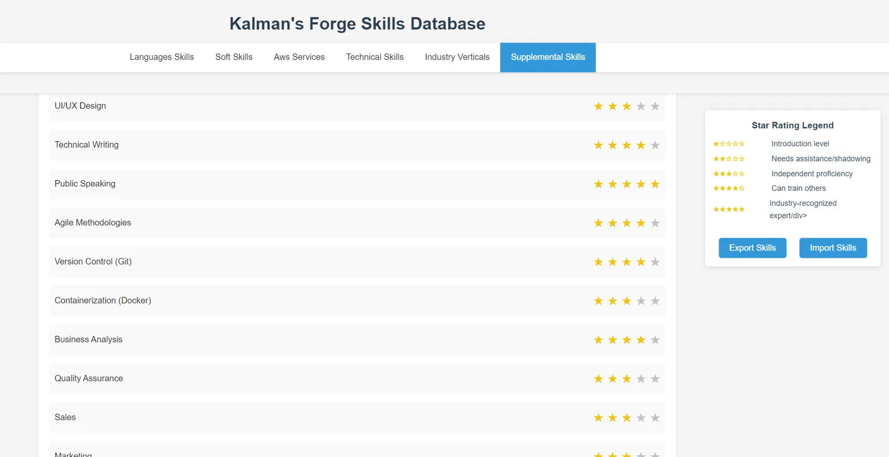

# Kalman's Forge Skills Database



## Overview

Kalman's Forge Skills Database is a web-based application designed for tracking and managing user skills across various categories. It provides a simple, user-friendly interface for self-assessment of proficiency levels in different areas.

## Features

- **User-friendly Interface**: Single page web application with multiple tabs
- **Skill Categories**: Organized into tabs including Languages, Soft Skills, AWS Services, Technical Skills, Industry Verticals, and more
- **5-Star Rating System**: Self-assessment of skills with a clear rating guide
- **Responsive Design**: Works on both desktop and mobile devices
- **Local Data Storage**: Secure storage of user data

## Getting Started

### Prerequisites

- Modern web browser
- Local server environment (e.g., Node.js, Python's http.server)

### Installation

1. Clone the repository:
   ```
   git clone https://github.com/your-username/kalmans-forge-skills-database.git
   ```
2. Navigate to the project directory:
   ```
   cd kalmans-forge-skills-database
   ```
3. Set up your local server environment (instructions may vary based on your chosen setup)

4. Open the application in your web browser

## Usage

1. Navigate through the different skill category tabs
2. Click on the stars to rate your proficiency in each skill
3. Your ratings are automatically saved to local storage

## Development Roadmap

### Phase 1: Core Functionality
- Basic UI with tabs and skill listing
- Star rating system
- Local data storage
- User authentication

### Phase 2: Enhanced Features
- Search and filtering capabilities
- Export/import functionality
- Basic administrative features

### Phase 3: Advanced Features (Future)
- Skill recommendation system
- Skill progression tracking
- Blockchain integration for skill verification

## Contributing

We welcome contributions to Kalman's Forge Skills Database! Please read our [CONTRIBUTING.md](CONTRIBUTING.md) for details on our code of conduct and the process for submitting pull requests.

## License

This project is licensed under the MIT License - see the [LICENSE.md](LICENSE.md) file for details.

## Acknowledgments

- Thanks to all contributors who have helped shape Kalman's Forge Skills Database
- Inspired by the need for a simple, effective skill tracking system in the tech industry

## Contact

For any questions or suggestions, please open an issue on this repository or contact the maintainers directly.

---

Happy Skill Tracking!
